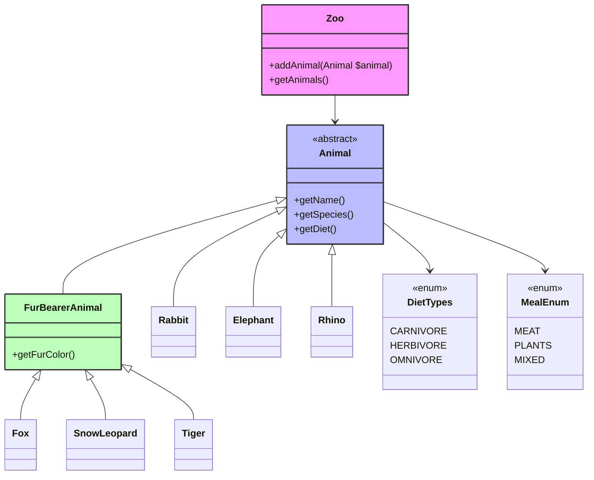

# Unity-t Exercise 1

## Requirements
- PHP 8.2 or higher
- Composer for dependency management

## Development Tools
The project uses several development tools to ensure code quality:
- PHPUnit for testing
- PHPStan for static analysis
- PHP CS Fixer for code style fixing

## Available Scripts
The following scripts are available in `composer.json`:

- `composer test`: Runs PHPUnit tests with colored output
- `composer analyse`: Performs static analysis using PHPStan
- `composer fix`: Fixes code style issues using PHP CS Fixer

## Project Structure


## Installation
```bash
composer install
```

## License
This project is licensed under the MIT License.

